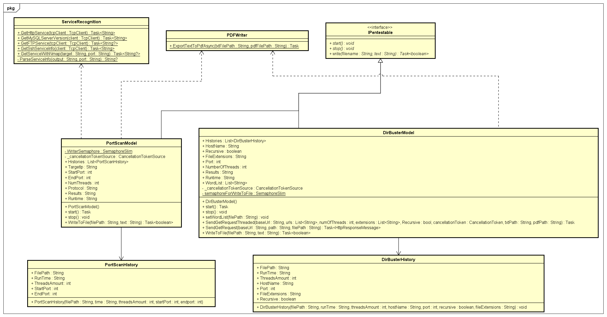

# Startdocument Threading in C#

Startdocument van **Victor Peters**, **Michel Disbergen**, **Stefan Meijer** en **Steffan van der Werf**

## Applicatie Beschrijving

De applicatie die ontwikkeld zal worden is een pentest framework. Met dit framework kunnen meerdere tools gebruikt worden tegenover een externe host:

- Een poortscanner. De poortscanner kan gebruikt worden om erachter te komen welke poorten open staan.
  Er wordt gebruik gemaakt van een uitgeklede **threadpool**. De threadpool wordt bijvoorbeeld gebruikt om gelijktijdig een x aantal poorten te scannen. De hoeveelheid poorten die gelijktijdig gescanned worden kan gelimiteerd worden door de gebruiker.
  Er wordt gebruikt gemaakt van **asynchronous input/output**. Asynchronous input/output wordt gebruikt om de verkregen resultaten (bijvoorbeeld of een poort open of gesloten is) te ontvangen en weg te schrijven naar een bestand. dit proces word ondersteuend met een **Semafore** om IO exepties te voorkomen dit geld ook voor de directory burster.

- Een directory buster. Dit is een bruteforce algoritme voor het vinden van mappen en bestanden op webservers.
  Er wordt gebruik gemaakt van **multithreading**. De gebruiker kan bijvoorbeeld bepalen hoeveel threads gebruikt zullen worden voor het zoeken van bestanden en mappen.
  Er wordt gebruik gemaakt van **async & await**. Async & await wordt bijvoorbeeld gebruikt bij het sturen van een request naar een externe host en het terugkrijgen van een response.

De applicatie zal ontwikkeld worden met **.NET maui**. De .NET versie die gebruikt gaat worden is .NET 8.0 en er wordt gebruik gemaakt van de IDE **Visual Studio 2022**.
Om deze applicatie te gebruiken moet [Nmap](https://nmap.org/download.html) geïnstalleerd zijn.

## Klassendiagram

## Requirements analyse

**must have**

- De gebruiker kan een bepaalde range aan poorten scannen.
- De gebruiker kan specifieke poorten scannen.
- De gebruiker krijgt te zien welke poorten open staan en welke services draaien.
- De gebruiker kan een website opgeven om directory brute-forcing op uit te voeren.
- De gebruiker krijgt te zien welke mappen en bestanden gevonden zijn.
- De gebruiker moet de optie krijgen of de directory buster recursief moet zoeken naar bestanden (als er een map gevonden wordt dan begint de directory buster opnieuw in die map).
- De gebruiker kan de resultaten van de pentests schrijven naar een bestand.

**should have**

- De gebruiker kan instellen of hij/zij TCP of UDP wilt gebruiken bij het scannen van ports.
- De gebruiker kan instellen hoeveel threads gebruikt worden bij de directory buster.

**could have**

- Er wordt een rapport gegenereerd als pdf bestand met de resultaten van de pentests.

**won't have**

- Er is integratie met derde partij software en API's mogelijk om meer functionaliteiten toe te voegen.
- Er zijn tools die het mogelijk maken om (Distributed) Denial of Service aanvallen uit te voeren.
- Er zijn tools waarmee de kwetsbaarheden van het systeem misbruikt kunnen worden.
- Er zijn tools waarmee ip addressen verkregen kunnen worden.
